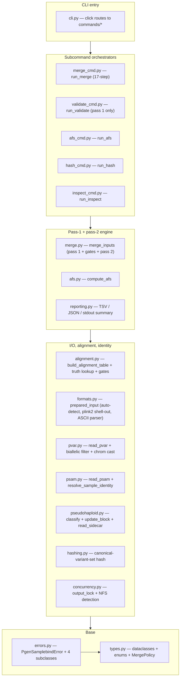
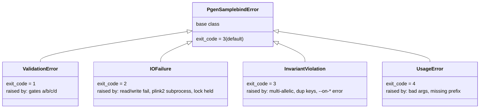

# Development guide

Architecture overview for new contributors. Read this once to orient on how the code fits together, then use [CONTRIBUTING.md](CONTRIBUTING.md) for the day-to-day process (dev setup, test markers, commit conventions, release flow).

This doc is descriptive, not prescriptive — it explains the design as it stands rather than enumerating rules. Everything load-bearing for understanding a contribution should be captured here or in the code's docstrings. If you hit a design decision that neither explains, that's a doc bug — file an issue.

## The two-pass merge

Sample-bind reduces to two passes over the inputs:

**Pass 1 — variant alignment (pandas)**. Read each input's `.pvar` (biallelic-SNP filter applied at parse time in `pvar.read_pvar`); build a single "alignment table" with one row per canonical (input[0]) variant and per-input columns recording `(action, drop_reason, source_row_idx)`. The action is one of `passthrough` / `swap` / `flip` / `flip_and_swap` / `drop` / `fill_missing` derived from the (canonical-ref, canonical-alt, other-ref, other-alt) tuple via the precomputed truth table (see §"The allele-resolution truth table" below). Variants destined to drop are kept as rows in the table — they're not removed, just marked — so the per-variant `--report` TSV can describe what was dropped and why. Reporting layers consume the same table.

**Pass 2 — genotype streaming (pgenlib)**. Filter the alignment table to its kept subset (`_kept_variants_table`: rows where no input's action is `DROP`). Open one `pgenlib.PgenReader` per input + one `pgenlib.PgenWriter` for the output, sized at the kept-variant count. Iterate the kept table in blocks (default 2048 variants), read the corresponding rows from each input's `.pgen` via `read_list`, apply the per-(variant, input) action vectorized, place into a per-block output buffer respecting the sample-identity plan, and write the buffer via `append_biallelic_batch`. Per-sample heterozygosity counters are updated inline so the orchestrator can classify pseudohaploid status at the end.

The split exists for three reasons:

1. **Memory bounded by the alignment table** (~250-300 MB at 1240k × 5 inputs), not by genotypes. We never hold the full genotype matrix in memory.
2. **PgenWriter needs the exact final variant count at open time** — pass 1 produces that count via `count_kept_variants(alignment_table)`.
3. **Failing fast on alignment problems saves pass-2 wallclock.** Gates (a)/(b)/(c) run between pass 1 and pass 2; an alignment that wouldn't have validated never hits the expensive streaming phase.

## Module map

13 modules in `src/pgen_samplebind/` + 5 thin subcommand orchestrators in `src/pgen_samplebind/commands/`. Layering goes top-down by dependency (arrows point from importer to imported): `cli.py` at the top, `types.py` at the bottom as the leaf, `errors.py` builds on `types`, everything else builds on top.



When making a change, the "scope" of your touch usually predicts the test surface: edits in `types.py` ripple everywhere; edits in `commands/*.py` rarely break anything outside the affected subcommand's integration tests.

## Key data structures (`types.py`)

Most data flow between layers goes through six dataclasses:

- **`MergePolicy`** (frozen) — every user-tunable behavior flag in one place: `on_mismatch` / `on_missing` / `on_extra` / `on_strand` / `on_collision` / `trust_strand` / `variant_key` / `target_min_call_rate` / `include_chrom` / `population_column` / `id_column` / `block_size` / `extras_warn_threshold` / `validate_strand_fail_pct` / `report_json_include_rows`. The CLI populates it once and passes it down; nothing else creates or mutates it. Note: `variant_key` controls whether alignment matches on `(chrom, pos)` (default) or `id` — same-position variants in different inputs with conflicting IDs need the `chr_pos` mode; cross-version cohort builds where positions may differ between releases need `id`. `include_chrom` defaults to autosomes (1-22); the AFS subcommand has `--include-sex-chrom` to extend to 23/24/25/26 (X/Y/XY/MT) for that specific path.

- **`InputDescriptor`** (frozen) — resolved metadata for one input after format detection: `path` (user's original prefix), `pgen_path` / `pvar_path` / `psam_path` (post-conversion canonical PFILE paths), `fmt`, `n_samples`, `n_variants`, `is_target`, optional `eigfile_tempdir`. BFILE / EIGENSTRAT inputs carry a tempdir handle that lives for the merge's duration; PFILE inputs have `eigfile_tempdir=None`.

- **`SampleIdentityPlan`** (frozen) — output of `psam.resolve_sample_identity`: which input samples survive (`per_input_keep_mask`), where each one lands in the output (`per_input_output_indices`), and the final IID list (`output_iids`). Computed by `run_merge` **before** `merge_inputs` runs (step 10) — `PgenWriter` needs the output `sample_ct` at open time, and the collision-suffix scheme needs to be resolved before pseudohaploid-sidecar overrides are mapped through to output IIDs.

- **`AlignmentSummary`** (mutable) — per-input action counts accumulated during `build_alignment_table`. Flows into the run summary and the report JSON.

- **`MergeContext`** (frozen) — passed to `merge_inputs` as the fourth arg: `policy`, `sample_plan`, `report_tsv_path`, `collect_variant_rows`, `show_progress`. Bundles everything `merge_inputs` needs to do its work without knowing about the broader CLI surface.

- **`MergeCounters`** (mutable) — returned by `merge_inputs` after pass 2. Carries:
  - `action_histogram`: per-input 9-key summary — `passthrough` / `swap` / `flip` / `fill_missing` / `dropped_ambiguous_strand` / `dropped_allele_mismatch` / `dropped_on_strand` / `pre_alignment_filter_dropped` / `drop`. `dropped_on_strand` is the bucket for `--on-strand drop` (non-ambiguous variants requiring flip); `drop` is the residual bucket for `ON_MISSING_DROP_VARIANT`. All 9 keys are always present in the emitted JSON so workflow consumers can rely on the schema regardless of merge outcome — don't drop or rename a key without auditing the report-JSON consumers.
  - `action_histogram_per_chrom`: per-chrom × 9-key breakdown (added in v0.2 for diagnostic surfacing in `--report-json`).
  - `intersection_size`, `extras_count`: pass-1 alignment-table counts.
  - `per_sample_het`: a `list[tuple[str, int, int]]` of `(output_iid, het_count, called_count)` in `output_iids` order — fed to `pseudohaploid.classify_all` at step 14.
  - `n_output_samples`, `n_output_variants`: bookkeeping.
  - `variant_rows`: optional, populated only when `--report-json-include-rows`.

  The orchestrator combines these counters with the per-input `.psam` DataFrames to finalize the output `.psam`.

`merge_inputs` writes `.pgen` + `.pvar` only; the orchestrator (`run_merge`) finalizes `.psam`. The split makes `merge_inputs` unit-testable against `MergeCounters` shape without needing `.psam`-parsing assertions. Output `.psam` column order is canonical: `FID, IID, SEX, POP, PSEUDOHAPLOID` first (FID-first per plink2 spec — the header line starts with `#FID`), then any extra columns alphabetized.

## The allele-resolution truth table

Pass-1 classification was the project's biggest hot path pre-v0.3 — at 1240k × N inputs scale it dominated pre-pass-2 wallclock. v0.3 replaced the per-row Python `for` loop with a precomputed numpy lookup.

**Encoding.** Each nucleotide maps to an int code: `A=0, C=1, G=2, T=3`. Non-ACGT cells (or pandas-NaN from a left-join miss) get code `4`. The 4D `(c_ref, c_alt, o_ref, o_alt)` index has shape `(4, 4, 5, 5) = 400` cells per `trust_strand` setting — canonical is always ACGT (the biallelic-SNP filter in `pvar.read_pvar` enforces this), so its axes are 4-wide; other can be invalid, so its axes are 5-wide.

**Construction.** At module-load time, `_build_classify_lookup(trust_strand)` calls `resolve_alleles(c_ref, c_alt, o_ref, o_alt, trust_strand)` for every ACGT combination (256 cases) and stores `(action.value, reason.value)` in two object-dtype arrays. The non-ACGT slabs (`[ci, ai, 4, :]` and `[ci, ai, :, 4]`) are force-filled with `DROP / ALLELE_MISMATCH`. Two tables — `_LOOKUP_TRUST` and `_LOOKUP_NOTRUST` — are built once and reused.

**Lookup.** Pass 1 does `actions = action_table[c_ref_codes, c_alt_codes, o_ref_codes, o_alt_codes]` — one numpy advanced-index call over the entire `merged` DataFrame. Pandas-NaN rows are then overridden to `FILL_MISSING` (precedence: variant-absent-in-other beats the table-derived `ALLELE_MISMATCH`). `--on-missing` and `--on-mismatch` policies are applied vectorized after the lookup.

The truth source is `resolve_alleles` (still kept in `alignment.py` as a single-row reference implementation); the table is just a memoization. If you change `resolve_alleles`, the lookup gets the change automatically on module reload.

**Action collapse on hardcalls.** This is a design contract — changing it would silently corrupt cross-source merges where strand-flip-alone appears. The six `MergeAction` values describe pass-1 intent at full fidelity for reporting, but pass-2 genotype recoding collapses them to just two physical operations on biallelic SNP hardcalls:

| Action | Pass-2 op on (block, sample) genotype |
|---|---|
| `PASSTHROUGH`, `STRAND_FLIP` | identity (no recoding) |
| `REF_ALT_SWAP`, `STRAND_FLIP_AND_SWAP` | `x → 2-x` (preserve `-9` missing) |
| `FILL_MISSING` | block row pre-filled with `-9`, no read needed |
| `DROP` | row excluded from the kept-variant subset; no pass-2 work |

`STRAND_FLIP` being identity is the non-obvious bit: complementing both alleles on a biallelic SNP preserves the binary `is_alt` semantic, so the genotype encoding doesn't change — only the .pvar's REF/ALT labels do (and the canonical pvar is what wins for downstream consumers, so we don't even re-emit them). This is why `_apply_actions_and_place` only checks the swap-mask and lets flip-alone fall through to passthrough.

## Block iteration with chromosome boundaries

`merge._iter_blocks_chrom_aware(alignment_table, block_size)` yields `(start, end)` ranges with two invariants:

1. `end - start <= block_size`
2. **No block spans a chromosome boundary.**

The chromosome-boundary invariant exists because `pseudohaploid.update_block(block, chrom, ...)` takes a single `chrom` arg and trusts the caller (it skips the update when `chrom > 22` — pseudohaploid status is computed over autosomes only). With the default autosome-only `include_chrom`, splitting at chrom transitions adds at most ~21 boundary-splits per pass at 1240k scale (1→2, 2→3, …, 21→22 = 21 transitions, negligible cost) and lets pseudohaploid drop the chrom-membership check from the inner loop.

If you touch the pass-2 loop in `merge.merge_inputs`, preserve this invariant. The block iterator is the only place enforcing it; everything downstream assumes it.

## The cM preservation chain

Genetic-position values (centiMorgans) travel end-to-end through the merge, not just for ergonomics — downstream Morgan-spaced jackknife consumers (AT2 `extract_f2 blgsize=0.05`) partition variants by cM, so dropping the column would collapse their jackknife block structure and silently bias variance estimates.

Flow: `pvar.read_pvar` parses the optional `CM` column from input `.pvar` (defaults to `0.0` when absent — emitted by plink2's `--eigfile` / `--bfile` converters when the source had cM, omitted otherwise). `alignment.build_alignment_table` carries `cm` on the canonical alignment row. `merge._write_pvar_tsv` emits it back to the output `.pvar`. Plink2's downstream `--make-bed` picks it up automatically.

The dogfood tier-2 test (`test_dogfood_pfile_to_bed_cm_preserved`) gates against regression: it round-trips a fixture through `pgen-samplebind merge` → `plink2 --make-bed` → reads back the `.bim` and asserts the cM column survived nonzero. A change anywhere in this chain that zeros out cM trips that test.

## The pseudohaploid precedence stack

Both `merge` and `afs` apply a 4-tier precedence when deciding per-sample pseudohaploid status (issue #2; v0.2 added the sidecar reader):

1. **`<input_prefix>.pseudohaploid.json` sidecar.** Upstream tools (e.g., pileup-aadr) know per-sample pseudohaploid status by construction; the sidecar lets that authoritative signal flow through. Schema v1: `{"schema_version": 1, "samples": {iid: {"pseudohaploid": 0|1}}}`. Read by `pseudohaploid.read_sidecar(prefix)`.
2. **Input `.psam` `PSEUDOHAPLOID` column.** Honored by `afs.compute_afs` when present (e.g., panels built by an earlier `pgen-samplebind merge` round-trip). Not honored by `merge` — `merge` re-derives from genotypes by design so that input ground-truth ≠ output detection is a meaningful regression test.
3. **Heterozygosity-derived inference (`pseudohaploid.classify`)** during pass 2: `het_count == 0` over non-missing autosomal calls → `PSEUDOHAPLOID`; `het_rate ≥ 0.05` → `DIPLOID`; everything in between → `UNKNOWN`. `called_count == 0` boundary → `UNKNOWN` (honest answer when there's no signal).
4. **All-diploid fallback** (`--no-pseudohaploid-adjust` on AFS) — silently treat every sample as diploid. The user opted out.

Orphan sidecar entries (IIDs in the JSON not present in the input `.psam`) raise `InvariantViolation` (exit 3) rather than being silently ignored — silent ignore would mask upstream / downstream contract drift.

## Validation gates a/b/c/d

Four data-shape gates that exit 1 (`ValidationError`) when triggered. In `merge` mode gates (a)/(b) run between pass 1 and pass 2 and (c) runs after pass 2; in `validate` mode all four (a)-(d) run, then the orchestrator exits without writing output.

- **(a) Extras.** Variants in input[N] absent from input[0] exceed `--on-extra` threshold (default 10% of input[0]). Catches the input-order-reversed footgun where the smaller panel is placed first and the larger panel's distinct variants silently drop.
- **(b) Ambiguous-strand drops.** Drops from A/T or C/G ambiguity exceed `--validate-strand-fail-pct` of the alignment **intersection** (default 10%). The intersection denominator is deliberate: catches the wrong-panel pairing case where a tiny intersection × normal drop rate would look fine against a canonical denominator.
- **(c) Target call rate.** Target's non-missing call count over canonical variants is below `--target-min-call-rate` (default 0.40). Runs only when at least one input has `is_target=True`. v0.2 generalized this to per-target: any failing target trips the gate.
- **(d) Soft-error policy triggers — `validate` mode only.** `validate` softens `--on-mismatch error` / `--on-missing error` / `--on-extra error` into a count + gate-(d) trigger via the `soften_policy_errors` flag on `build_alignment_table`, rather than aborting at the first hit. This lets `validate` report the full picture instead of fail-fast. In `merge` mode those policies aren't softened — they raise `InvariantViolation` and exit 3.

Gates (a) and (b) live in `alignment.evaluate_pass1_gates`. Gate (c) lives in `merge._check_target_call_rate` (genotype-dependent, runs after pass 2). Gate (d) is conceptually a post-condition on the `AlignmentSummary.policy_error_triggers` dict populated by `build_alignment_table(soften_policy_errors=True)`.

## Exit codes and the exception hierarchy

`cli.main()` catches `PgenSamplebindError` and exits with `e.exit_code`. Click's `standalone_mode=False` is pinned because click's default exit-2 on usage errors would collide with our exit-2 reservation for I/O failures.



Stable across versions; safe to script against. Mapping rule of thumb when adding a new error: if the user could fix it by changing data → exit 1; if their machine prevented it → exit 2; if it's a data invariant they should have caught upstream → exit 3; if it's a CLI mistake → exit 4.

## pgenlib gotchas

The C-level Python bindings (`pgenlib.PgenReader` / `PgenWriter`) drive everything in pass 2. Worth knowing before touching that code:

- **GIL is released during reads.** Each `read` / `read_range` / `read_list` call wraps the underlying `PgrGet*` C function in `with nogil:`. Python threads block on Python bytecode, not on the I/O.
- **Per-instance state is stateful.** Each `PgenReader` carries pre-allocated working buffers (`_pgv.genovec`, `_raregeno_buf`, `_state_ptr`, `_subset_include_vec`). Concurrent calls on the **same** instance would race on those buffers. Don't share readers across threads.
- **Multi-instance + same-file IS supported.** The pgenlib upstream `tests/test_multithread.py` runs one `PgenReader` per `ThreadPoolExecutor` worker reading disjoint variant ranges of the same `.pgen`, and asserts byte-equality vs the single-threaded result. We follow the same pattern in `merge.merge_inputs`: one reader per input, all in the same thread.
- **PgenWriter is single-threaded.** Don't add a parallel writer — there's no upstream contract for it.
- **Buffer shape must be `(block_size, n_samples)` `int8`.** Flat 1D buffers raise `ValueError: Buffer has wrong number of dimensions (expected 2, got 1)`. The sample-major variant (`sample_maj=1`) wants `(n_samples, block_size)` instead.
- **Multi-allelic input segfaults pgenlib.** Our `pvar.check_max_alleles` is a startup gate (`max_allele_ct > 2` raises `InvariantViolation`) because the C-layer SIGSEGV in `PgrGet1` for multi-allelic data is uncatchable from Python.

The pgenlib API behavior is documented in [`pgenlib`'s `python_api.txt`](https://github.com/chrchang/plink-ng/blob/master/2.0/Python/python_api.txt); the multithread idiom is in `tests/test_multithread.py` upstream.

## The 17-step merge orchestration

`commands/merge_cmd.py` is the canonical example of how the layers compose. The step numbers below match the `# Step N:` comments in that file (search for them to jump to each step's implementation); gaps in the numbering exist for historical reasons — some steps were merged or moved as the design firmed up — but the numbers are stable between the code and this doc. Grouped by phase:

**Setup (steps 1-3).** Build `MergePolicy` from CLI args. Acquire `output_lock(output_prefix)` as the FIRST entrant on the ExitStack so a held lock fails out before any input is touched.

**Input preparation (steps 4-9).** Build `all_input_paths = (*input_paths, *target_paths)` and `target_idxs`. For each input, `prepared_input(prefix, is_target=(i in target_idxs), include_chrom)` either resolves PFILE paths directly or shells out to plink2 for BFILE / EIGENSTRAT conversion in a per-invocation tempdir. Run `check_max_alleles` to gate multi-allelic input. Read `.psam` for each input; auto-detect the population column (POP / PHENO / PHENO1 fallback); apply `--relabel-from` if specified; set `FID = POP` (AT2 compatibility).

**Sample identity + sidecar collection (steps 10-10b).** `resolve_sample_identity` builds the `SampleIdentityPlan` (collision policy applied; output_iids known). Per-input `<prefix>.pseudohaploid.json` sidecars are read and mapped through the collision plan to output IIDs, ready for step 14.

**Context construction (step 11).** Build `MergeContext` with `show_progress = (not quiet and sys.stderr.isatty())` so workflow managers see clean piped logs while interactive users see a live `tqdm` bar.

**Execution (step 12).** `merge_inputs(descriptors, out_pgen_path, out_pvar_path, ctx)` does pass 1 + gates (a)/(b) + pass 2 + gate (c) + `.pvar` write. Returns `MergeCounters`. Wrapped in a `try/except PgenSamplebindError` that unlinks the partial triplet on any failure — half-built outputs never reach downstream pipelines.

**Finalization (steps 13-15).** Build `merged_psam` via `psam.merge_psams(psam_dfs, sample_plan)`. Compute pseudohaploid statuses from `counters.per_sample_het` via `classify_all`; override per-sample with `sidecar_overrides[output_iid]` where present. A `__debug__` row-order invariant assertion checks `counters.per_sample_het[i][0] == sample_plan.output_iids[i] == merged_psam.iloc[i]["IID"]` — silent misalignment would corrupt downstream qpAdm. Write `.psam`.

**Reporting (steps 16-17).** Optional `--report-json` write. Stdout summary block unless `--quiet`.

`run_validate` follows steps 1-11 of the same flow, replaces step 12 with `build_alignment_table(soften_policy_errors=True)` + `evaluate_pass1_gates(is_validate_mode=True)`, and skips 13-15 (no `.psam` write).

## The perf-bench loop

`tests/integration/test_perf_benchmark.py` synthesizes a fixed-size two-panel merge, measures wallclock + throughput + peak RSS, and asserts:

```
elapsed_s < wallclock_s_ceiling           (120s; sanity bound)
peak_rss_mb < max_rss_mb_ceiling          (2048 MB; sanity bound)
throughput >= threshold_pct * baseline    (gating; 80% × 65M = 52M g/s)
```

Linux x86_64 only (per `_is_linux_x86_64()` guard) — macOS runners have inconsistent CPU profiles. The `[perf] elapsed=… throughput=… peak_rss=…` line is `print`ed unconditionally and surfaces in the CI log (the workflow uses `-s` so pytest's stdout capture doesn't swallow it on PASS).

The baseline lives in `tests/integration/perf_baseline.json` with a `_calibration_notes` audit trail. The procedure for bumping it on an intentional perf change is in [CONTRIBUTING.md §Performance baseline maintenance](CONTRIBUTING.md#performance-baseline-maintenance).

**Hot-path discipline.** The v0.3 release pass replaced five Python-level loops with vectorized numpy / pandas equivalents (build_alignment_table truth-table lookup, `_apply_actions_and_place` swap + placement, `normalize_chrom`, `validate_unique_keys`, `_tally_actions_to_summary`). The pattern to follow when adding code in any module called from pass 1 or pass 2:

- **Per-row `.apply()` / `iterrows()` / Python `for x in series`** = code smell. Reach for a precomputed lookup, a vectorized truth table, or `pd.Series.value_counts()` instead.
- **Allocate inside the block loop only when shape requires it.** Reusing buffers across blocks is fine; the read buffers in `_read_block_from_input` pay an `np.empty((n_to_read, n_samples_input), dtype=np.int8)` cost per block because each input's keep-mask differs.
- **`with nogil:` matters in C extensions, not in pure-Python loops.** A `with nogil:` block in pgenlib doesn't help if the Python work around it is the bottleneck.

The 5-pole v0.3 CHANGELOG entry documents the before/after for each loop if you need a reference template.

## The dogfood architecture

`tests/dogfood/` is the project's regression spine. A 44-sample × 50K-variant fixture (vendored under fair-use; provenance script `build_fixture.py` regenerates from AADR + auxiliary panels) flows through `pgen-samplebind merge` and is verified against a mergeit-pipeline reference qpAdm TSV.

Three tiers, gated by tool availability via `pytest.skipif(HAS_PLINK2)` / `pytest.skipif(HAS_ADMIXTOOLS)` in `conftest.py`:

- **Tier 1** (no external deps) — verifies panel shape, cM preservation through pass 2, FID=POP, PSEUDOHAPLOID column populated. Always runs.
- **Tier 2** (plink2 on PATH) — re-exports the PFILE output to BED via `plink2 --make-bed`; asserts cM survives the conversion intact (downstream Morgan-spaced jackknife consumers depend on this).
- **Tier 3** (plink2 + R + admixtools) — runs `extract_f2 + qpAdm` over the merged panel and per-cell-compares against the vendored mergeit reference (tolerance 1e-6 on weights, 1e-4 on `p_tail` — bounds set by cross-architecture float-arithmetic noise, not by the merge itself).

Tier 3 is what gives the "byte-equal qpAdm parity" claim teeth. The reference TSV was generated once via the established `mergeit + plink2 + AdmixTools 2` pipeline on the same fixture; any change in pgen-samplebind that produces drift from that reference will fail the per-cell comparison in CI.

When making a change that touches pass-1 alignment, pass-2 streaming, or any policy that affects the output `.pgen` / `.pvar`: dogfood's tier-3 result is the regression bar. If you can't get plink2 + R + admixtools installed locally, that's fine — the CI `dogfood` job runs all three tiers on every commit.

## When in doubt, file an issue

If a change feels like it's bumping into design intent you don't have context for — a contract this doc didn't explain, an invariant the code asserts but the rationale isn't obvious, a scope-fit call that's borderline — file an issue first. Scope-fit + design-intent calls are easier to make together than to litigate at PR review, and the resolution is a candidate for a follow-up edit to this doc so the next contributor doesn't hit the same gap.
